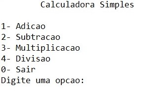
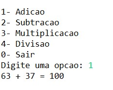
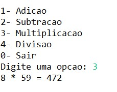
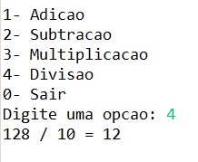
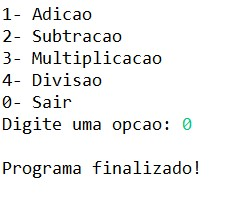

# T1 - Implementação de calculadora de modo aleatório

## Rodando 

Você precisará [instalar](https://www.oracle.com/java/technologies/downloads/) e [configurar](https://docs.oracle.com/cd/E19182-01/820-7851/inst_cli_jdk_javahome_t/) a plataforma de desenvolvimento **Java** para rodar este programa!

Dentro do diretório raiz do repositório, você precisará navegar até a calculadora:

``` bat 
  cd .\Calculadora_simles\src\ 
```
ou, em sistemas baseados em Unix: 
``` bat
  cd ./Calculadora_simles/src/ 
```
Agora, será necessário compilar os arquivos .java com o seguinte comando:

``` bat 
  javac Main.java 
```

Finalmente, é só rodar:

``` bat 
  java Main
```

Obrigado pela atenção! 

## Como utilizar

A primeira tela na qual aparecerá, ao iniciar o programa feito em Java pelo terminal, é o menu como visto a seguir:



Logo após isso, o usuário poderá escolher uma das opções sugeridas e, ao escolher uma das operações matemáticas, o programa gerará dois números aleatórios para realizar a operação desejada, veja:

**_Exemplo de adição:_**




**_Exemplo de subtração:_**


**_Exemplo de multiplicação:_**




**_Exemplo de divisão:_**




O programa rodará até o momento que o usuário digitar a opção 0 - sair:



---

## Ferramenta/IDE utilizada pelos membros 
- Gabriel Ramos Trindade: Eclipse e Visual Studio Code.
- Marcelo Carlos Olimpio Junior: Eclipse
