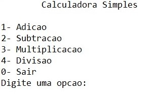
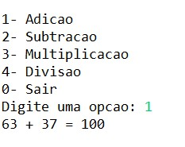
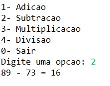
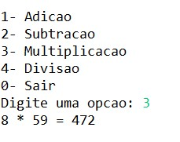
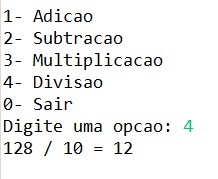
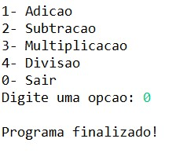

# T1 - Implementação de calculadora de modo aleatório
---

## Como utilizar 

A primeira tela na qual aparecerá, ao iniciar o programa feito em Java pelo terminal, é o menu como visto a seguir:

Logo após isso, o usuário poderá escolher uma das opções sugeridas e, ao escolher uma das operações matemáticas, o programa gerará dois números aleatórios para realizar a operação desejada, veja:

**_Exemplo de adição:_**

**_Exemplo de subtração:_**

**_Exemplo de multiplicação:_**

**_Exemplo de divisão:_**

O programa rodará até o momento que o usuário digitar a opção 0 - sair:

---

## Ferramenta/IDE utilizada pelos membros 
- Gabriel Ramos Trindade: Eclipse e Visual Studio Code.
- Marcelo Carlos Olimpio Junior: ... 
